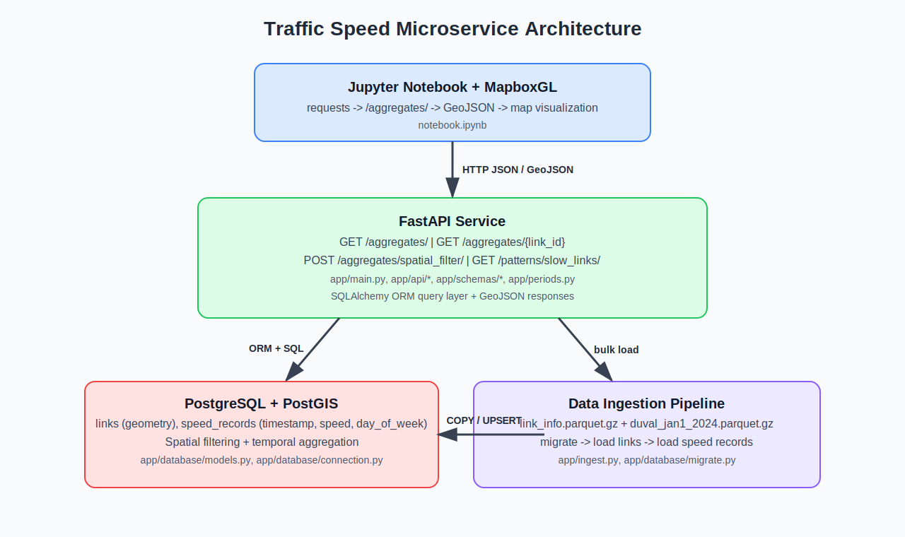

# Traffic Speed Microservice

A FastAPI microservice for ingesting and querying geospatial traffic speed data using PostgreSQL + PostGIS.

## Architecture



```
┌─────────────────────────────────────────────────────────────────┐
│                        Jupyter Notebook                         │
│        requests  →  /aggregates/  →  MapboxGL LinestringViz     │
└───────────────────────────┬─────────────────────────────────────┘
                            │ HTTP / JSON + GeoJSON
┌───────────────────────────▼─────────────────────────────────────┐
│                      FastAPI  (port 8000)                       │
│                                                                 │
│  GET  /aggregates/                   avg speed per link         │
│  GET  /aggregates/{link_id}          single segment detail      │
│  POST /aggregates/spatial_filter/    bbox intersection          │
│  GET  /patterns/slow_links/          consistently slow links    │
│                                                                 │
│       app/api/   app/schemas/   app/periods.py                  │
└───────────────────────────┬─────────────────────────────────────┘
                            │ SQLAlchemy ORM
┌───────────────────────────▼─────────────────────────────────────┐
│               PostgreSQL + PostGIS  (port 5432)                 │
│                                                                 │
│  links          link_id PK · road_name · geometry (GEOMETRY)    │
│  speed_records  id PK · link_id FK · timestamp · speed          │
│                 day_of_week                                     │
│                                                                 │
│  Index: (day_of_week, link_id)  ← fast period/day queries       │
└───────────────────────────┬─────────────────────────────────────┘
                            │ PostgreSQL COPY protocol
┌───────────────────────────▼─────────────────────────────────────┐
│                       Data Ingestion                            │
│                                                                 │
│  link_info.parquet.gz        →  links table                     │
│  duval_jan1_2024.parquet.gz  →  speed_records table (100k+ rows)│
│                                                                 │
│  app/ingest.py  Ingester class                                  │
└─────────────────────────────────────────────────────────────────┘
```

## Requirements

- Docker + Docker Compose

## Quickstart

```bash
# Start the database and API
make up

# Download datasets (optional; `make ingest` also does this automatically)
make data-download

# Run database migrations
make migrate

# Ingest the parquet datasets into Postgres
make ingest

# API is available at http://localhost:8000
# Docs at http://localhost:8000/docs
```

## Data Files

The parquet datasets are not tracked in git. They are downloaded on demand from:

- `https://cdn.urbansdk.com/data-engineering-interview/link_info.parquet.gz`
- `https://cdn.urbansdk.com/data-engineering-interview/duval_jan1_2024.parquet.gz`

Use:

```bash
make data-download
```

or simply run:

```bash
make ingest
```

which will auto-download missing files before ingesting.

## API Endpoints

All list endpoints support `limit` (default 100, max 1000) and `offset` (default 0) query parameters for pagination.

| Method | Path | Description |
|--------|------|-------------|
| GET | `/health` | Health check |
| GET | `/aggregates/` | Average speed per link for a given day and period |
| GET | `/aggregates/{link_id}` | Speed and metadata for a single road segment |
| POST | `/aggregates/spatial_filter/` | Links intersecting a bounding box |
| GET | `/patterns/slow_links/` | Links consistently below a speed threshold |

### Time Periods

| ID | Name | Hours |
|----|------|-------|
| 1 | Overnight | 00:00–03:59 |
| 2 | Early Morning | 04:00–06:59 |
| 3 | AM Peak | 07:00–09:59 |
| 4 | Midday | 10:00–12:59 |
| 5 | Early Afternoon | 13:00–15:59 |
| 6 | PM Peak | 16:00–18:59 |
| 7 | Evening | 19:00–23:59 |

### Example Requests

```bash
# Aggregates for Monday AM Peak (paginated)
curl "http://localhost:8000/aggregates/?day=Monday&period=AM+Peak&limit=50&offset=0"

# Single link
curl "http://localhost:8000/aggregates/12345?day=Monday&period=AM+Peak"

# Spatial filter
curl -X POST "http://localhost:8000/aggregates/spatial_filter/" \
  -H "Content-Type: application/json" \
  -d '{"day": "Wednesday", "period": "AM Peak", "bbox": [-81.8, 30.1, -81.6, 30.3]}'

# Slow links
curl "http://localhost:8000/patterns/slow_links/?period=AM+Peak&threshold=30.0&min_days=3"
```

## Development

```bash
# Run all tests (unit + integration) with coverage report
make test

# Run only unit tests with coverage report
make unit-tests

# Run only integration tests
make integration-tests

# Enforce 100% unit-test coverage
make coverage

# Download datasets only
make data-download

# Lint
make lint

# Format
make format

# View logs
make logs
```

## CI

GitHub Actions workflow: `.github/workflows/ci.yml`

- Runs on push to `master` and `main`
- Runs on pull requests targeting `master` and `main`
- Supports manual runs via `workflow_dispatch`
- Executes lint checks plus unit tests with `--cov-fail-under=100`

## API Collection

Importable Postman collection:

- `UrbanSDK_Traffic_API.postman_collection.json`

## Project Structure

```
app/
├── api/            # Route handlers (views)
├── database/       # ORM models and connection
├── schemas/        # Pydantic response schemas
├── constants.py    # Time period definitions
├── ingest.py       # Parquet data ingestion
├── main.py         # FastAPI app entrypoint
├── periods.py      # Period/day resolution helpers
└── settings.py     # Environment config
tests/
├── integration/    # End-to-end tests against real data
├── factories.py    # Test data factories
├── conftest.py     # Shared fixtures
└── test_*.py       # Unit tests
```
